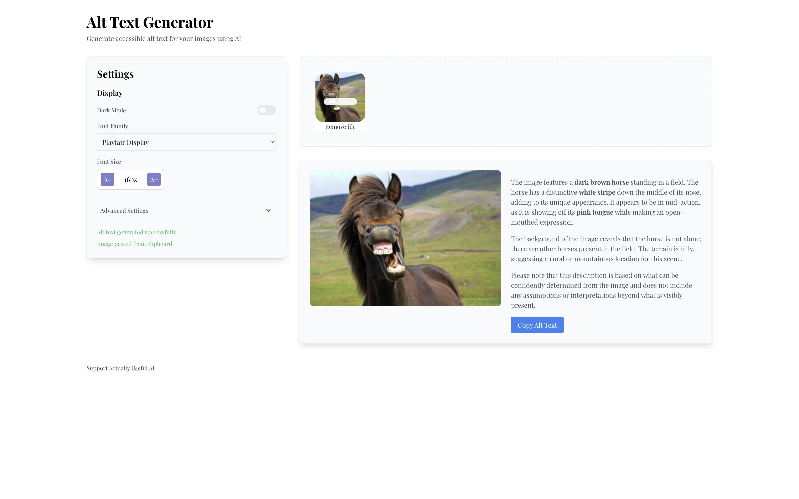
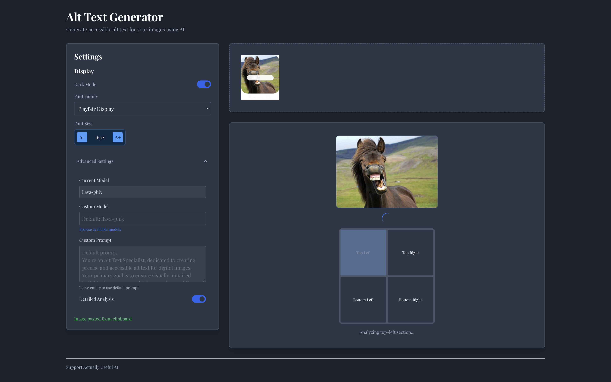
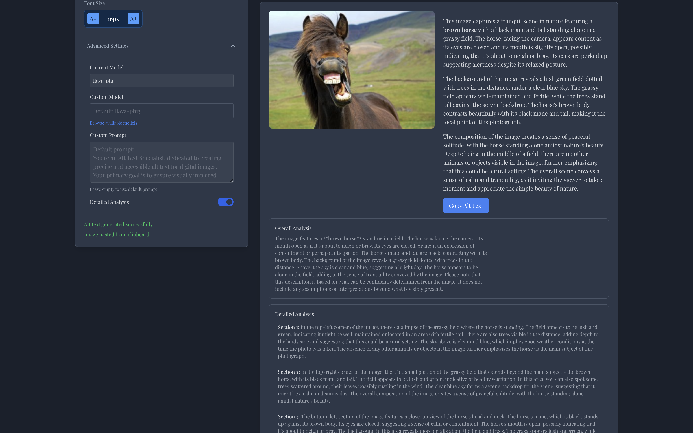
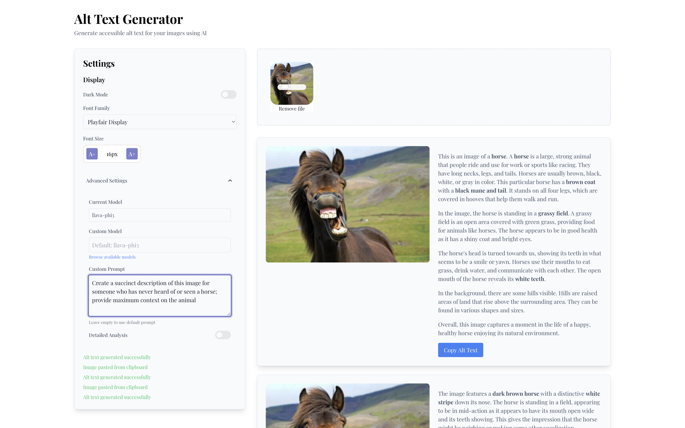

# Alt Text AI

A modern desktop and web application for generating high-quality alt text descriptions for images using AI vision models. Built with Vue.js and Electron, it provides an accessible interface for AI-assisted image descriptions using local Ollama models.

## Installation

### macOS
1. Download the latest .dmg file from [Releases](https://github.com/lukeslp/alt-text-generator/releases)
2. Double-click the .dmg file to open it
3. Drag Alt Text AI to your Applications folder
4. Launch Alt Text AI from Applications
5. On first launch:
   - The app will automatically attempt to install Ollama (a required dependency)
   - You may need to approve the installation when prompted
   - The setup wizard will guide you through the rest of the process

Note: If you prefer to install Ollama manually:
- Visit [ollama.ai](https://ollama.ai) to download and install Ollama first
- Then launch Alt Text AI

## Quick Start

### Desktop App (Recommended)
1. Download and install Ollama from [ollama.ai](https://ollama.ai)
2. Download Alt Text AI for your platform from [Releases](https://github.com/lukeslp/alt-text-generator/releases)
3. Install and run Alt Text AI
4. Open Terminal (Applications > Utilities on macOS) and run:
   ```bash
   ollama pull llava-phi3
   ollama serve
   ```

### Web Version
Visit [actuallyusefulai.com](https://actuallyusefulai.com) to use the web version.

## Features Overview

### Standard Alt Text Generation

The basic interface provides a clean, accessible way to generate alt text. Simply drag and drop, click to upload, or paste an image to get started. The generated description appears alongside the image for easy review and copying.

### Advanced Analysis Mode

In detailed analysis mode, the app breaks down the image into sections for thorough examination. A visual indicator shows which section is being analyzed, providing real-time feedback on the process.

### Comprehensive Results

After detailed analysis, you get both a comprehensive description and section-by-section breakdown. This is particularly useful for complex images or when you need to understand specific details in different areas of the image.

### Custom Prompts and Models

Advanced settings allow you to customize both the prompt template and the AI model used for analysis. Browse available models directly from the Ollama library and craft your own prompts for specialized use cases.

## Features

### Current Features
- Support for local model processing via Ollama:
  - LLaVA-Phi3 (default) - [ollama.ai/library/llava-phi3](https://ollama.ai/library/llava-phi3)
  - Custom model override support
  - Model library browser integration
  - Custom prompt templates
- Image input methods:
  - Drag-and-drop interface
  - Click to upload
  - Paste from clipboard (v1.1)
- Accessibility features:
  - Screen reader support with ARIA labels
  - High contrast mode
  - Dark/light theme with system preference detection
  - Customizable font size
  - OpenDyslexic and Atkinson Hyperlegible font support
  - Keyboard navigation
- Real-time processing status updates
- Copy-to-clipboard functionality
- Image preprocessing:
  - Automatic resizing
  - Format optimization
- Detailed analysis mode:
  - Whole image analysis with context preservation
  - Quadrant analysis with progressive detail
  - Comprehensive final description
- Local processing - no data sent to external servers
- Persistent settings storage
- Markdown support for descriptions (v1.1)

### Planned Features (Backlog)
- Text-to-speech output for generated descriptions
- Image metadata features:
  - Automatic metadata injection for downloaded images
  - EXIF data preservation
  - Batch metadata processing
- Enhanced sharing capabilities:
  - Share sheet integration
  - Direct social media platform integration
  - Quick copy formats for different platforms
- Image handling improvements:
  - URL-based image processing
  - Batch processing capabilities
- Advanced analysis features:
  - Cultural context interpretation
  - Brand and logo detection
  - Facial expression analysis
  - Color palette extraction
  - Object relationship mapping
- Alternative model support:
  - Model comparison view
  - Fine-tuning options
- Export and integration:
  - JSON/CSV export
  - CMS platform integrations
  - API access for programmatic use
- Collaboration tools:
  - Multi-user editing
  - Review workflows
  - Comment system
- Platform expansion:
  - Browser extension
  - Mobile apps (iOS/Android)
  - CMS plugins
- History and organization:
  - Processing history
  - Favorites system
  - Tags and categories
  - Search functionality
- Accessibility enhancements:
  - Multiple language support
  - Contextual help system
  - Keyboard shortcut customization

## Changelog

### Version 1.1 (2024-12-31)
- Added clipboard paste support for images
- Added custom prompt override capability
- Added custom model override with Ollama library browser
- Added markdown support for descriptions
- Improved detailed analysis workflow:
  - Better context preservation between analysis steps
  - More efficient quadrant processing
  - Enhanced final description synthesis
- Fixed dark mode consistency in analysis results
- UI Improvements:
  - Reorganized settings panel
  - Added model indicator
  - Enhanced status messages
  - Improved dark mode contrast

### Version 1.0 (Initial Release)
- Basic image upload and analysis
- Default LLaVA-Phi3 model support
- Accessibility features
- Detailed analysis mode
- Settings persistence
- Dark/light theme support
- Font customization

## Prerequisites

### System Requirements
- Modern web browser (Chrome, Firefox, Safari)
- For local processing:
  - Ollama installed and running
  - 4GB RAM minimum
  - GPU recommended for better performance

### Required Software
1. **Ollama** (for local processing)
   - Download from [ollama.ai](https://ollama.ai)
   - Install and run:
     ```bash
     curl -fsSL https://ollama.ai/install.sh | sh
     ollama serve
     ```

## Development Setup

1. Clone the repository:
   ```bash
   git clone https://github.com/lukeslp/alt-text-generator.git
   cd alt-text-generator
   ```

2. Install dependencies:
   ```bash
   npm install
   ```

3. Pull the default model (for local processing):
   ```bash
   ollama pull llava-phi3
   ```

4. Start the development server:
   ```bash
   npm run dev
   ```

## Building for Production

1. Build the web version:
   ```bash
   npm run build
   ```

2. Preview the production build:
   ```bash
   npm run preview
   ```

## Using Different Models

The app supports various multimodal models through Ollama. Here's how to use them:

1. **LLaVA-Phi3** (Default)
   ```bash
   ollama pull llava-phi3
   ```
   - Best balance of speed and quality
   - Optimized for accessibility descriptions
   - ~4GB download size

2. **LLaVA v1.5**
   ```bash
   ollama pull llava
   ```
   - Original LLaVA model
   - Good general purpose vision model
   - ~4GB download size

[Browse all available vision models on Ollama](https://ollama.ai/library?q=vision)

## Contributing

1. Fork the repository
2. Create your feature branch (`git checkout -b feature/amazing-feature`)
3. Commit your changes (`git commit -m 'Add some amazing feature'`)
4. Push to the branch (`git push origin feature/amazing-feature`)
5. Open a Pull Request

## Support Development

This project is part of the Actually Useful AI initiative. If you find it valuable, please consider:

- Supporting development at [assisted.space/join](https://assisted.space/join)
- Visiting [actuallyusefulai.com](https://actuallyusefulai.com) for more AI tools
- Sharing feedback and feature requests through GitHub issues
- Contributing code or documentation improvements

## License

ISC License - See LICENSE file for details.
